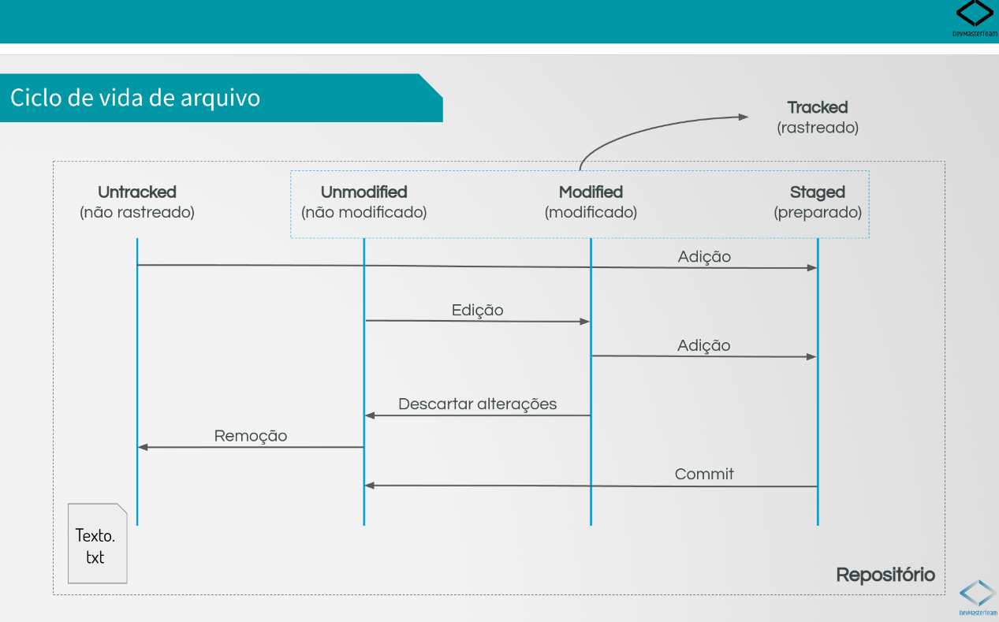

# Quatro estados de um arquivo no Git / Four states of a file in Git

## 1. Untracked (Não rastreado)
**PT-BR**  
Um arquivo "Untracked" é um arquivo que o Git não está rastreando. Isso significa que o Git não está ciente da existência desse arquivo.

***

**EN-US**  
An "Untracked" file is a file that Git is not tracking. This means that Git is not aware of the existence of this file.

***

## 2. Staged (Preparado)
**PT-BR**  
Um arquivo "Staged" é um arquivo que foi adicionado à área de preparação. Isso significa que o Git está ciente da existência desse arquivo e está pronto para incluí-lo no próximo commit.

Um arquivo Untracked pode ser movido para o estado Staged usando o comando `git add`.

***

**EN-US**  
A "Staged" file is a file that has been added to the staging area. This means that Git is aware of the existence of this file and is ready to include it in the next commit.

An Untracked file can be moved to the Staged state using the `git add` command.

***

## 3. Unmodified (Não modificado)
**PT-BR**  
Um arquivo "Unmodified" é um arquivo que não foi modificado desde o último commit. Isso significa que o Git está ciente da existência desse arquivo e que o conteúdo do arquivo é o mesmo que o último commit.

Um arquivo Staged será movido para o estado Unmodified após uso do comando `git commit`.

***

**EN-US**  
An "Unmodified" file is a file that has not been modified since the last commit. This means that Git is aware of the existence of this file and that the content of the file is the same as the last commit.

A Staged file will be moved to the Unmodified state after using the `git commit` command.

***

## 4. Modified (Modificado)
**PT-BR**  
Um arquivo "Modified" é um arquivo que foi modificado desde o último commit. Isso significa que o Git está ciente da existência desse arquivo e que o conteúdo do arquivo é diferente do último commit.

Um arquivo Unmodified será movido para o estado Modified após ser modificado. Se as modificações forem descartadas, o arquivo voltará para o estado Unmodified.

Um arquivo Modified pode ser movido para o estado Staged usando o comando `git add`.

***

**EN-US**  
A "Modified" file is a file that has been modified since the last commit. This means that Git is aware of the existence of this file and that the content of the file is different from the last commit.

An Unmodified file will be moved to the Modified state after being modified. If the modifications are discarded, the file will return to the Unmodified state.

A Modified file can be moved to the Staged state using the `git add` command.

***

## Imagem exemplo / Example image
