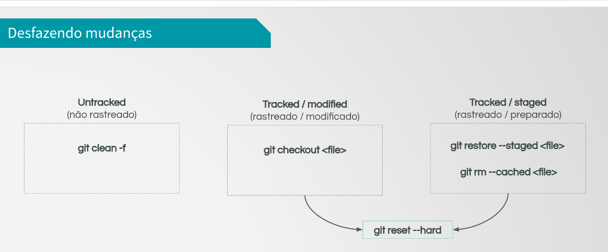

# Comandos Básicos / Basic Commands

## Configuração do Usuário / User Configuration
```bash

git config --global user.name "My Name"
git config --global user.email "myemail@gmail.com"


# Verificando a configuração / Verifying the configuration

git config --global user.name
git config --global user.email
git config --list    
```

## Criando um repositório local / Creating a local repository
```bash
git init
```

## Verificando o status do repositório / Checking the repository status
```bash
git status
```

##  Adicionando arquivos à área de stage / Add files to the staging area
```bash
#Adiciona um arquivo específico / Adds a specific file
git add file.txt

#Adiciona todos os arquivos / Adds all files
git add .
git add -A
git add --all
```

## Removendo arquivos da área de stage / Removing files from the staging area
```bash
# Remove um arquivo específico / Removes a specific file
git rm --cached file.txt

# Remove todos os arquivos / Removes all files
git rm --cached -r .
```

## Commitando arquivos / Committing files
```bash
git commit -m "Commit message"
```

## Visualizando alterações / Viewing changes
```bash
# Somente se o arquivo não estiver na área de stage
# Only if the file is not in the staging area
git diff

# Se o arquivo estiver na área de stage
# If the file is in the staging area
git diff --staged
```

## Histórico de commits / Commit history
```bash
git log
```

Exemplo de saída / Output example:
```bash
commit c55971099240ec7af47fcad47bb6993fd7272a43 (HEAD -> master, origin/master, origin/HEAD)
Author: Matheus Avila <matheus.avila@grad.ufsc.br>
Date:   Mon Feb 19 18:40:32 2024 -0300

    Four States readme

#c55971099240ec7af47fcad47bb6993fd7272a43 é o hash do commit / is the commit hash

#HEAD é o ponteiro para o último commit / is the pointer to the last commit

#master é o nome do branch / is the branch name

#origin/master e origin/HEAD são ponteiros para o último commit no repositório remoto / are pointers to the last commit in the remote repository

#Author é o autor do commit e seu email / is the commit author and his email

#Date é a data e hora do commit / is the commit date and time

#Four States readme é a mensagem do commit / is the commit message

```
Para sair do log, pressione a tecla "q" / To exit the log, press the "q" key.

### Variações do log / Log variations
```bash
# Log com um commit por linha / Log with one commit per line
git log --oneline

# Log mostrando N commits / Log showing N commits
git log -N

# Log mostrando N commits com um commit por linha / Log showing N commits with one commit per line
git log -N --oneline

# Log mostrando as diferenças entre os commits / Log showing the differences between commits
git log -p

# Mostra os arquivos alterados em cada commit / Shows the files changed in each commit
git log --stat

# Versão resumida do stat / Short version of stat
git log --shortstat
```

## Alterando o último commit / Changing the last commit
```bash
git commit --amend -m "New commit message"

# ou caso não queira alterar a mensagem do commit anterior / or if you don't want to change the previous commit message
git commit --amend --no-edit
```

## Navegando entre commits / Navigating between commits
```bash
git checkout <hash>

# Para voltar ao HEAD / To return to HEAD
git checkout master
```

## Desfazendo alterações / Undoing changes
```bash
# Observação: isso serve para arquivos que não estão na área de stage / Note: this is for files that are not in the staging area

# Desfaz as alterações no arquivo / Undoes changes in the file
git checkout file.txt

# Desfaz alterações em tudo / Undoes changes in everything
git checkout .

# Remove arquivos não rastreados / Removes untracked files
git clean -f
```

## Removendo da área de stage / Removing from the staging area
```bash

# Remove da área de stage / Removes from the staging area
git rm --cached file.txt

# Remove da area de stage e descarta as alterações / Removes from the staging area and discards changes
git reset --hard
```

***

***

## Gitignore
Ignora arquivos e diretórios / Ignores files and directories.

Exemplo:
```bash
# Arquivos .txt
*.txt

# Diretório / Directory
diretorio/
```

### Uma coleção de templates .gitignore: / A collection of .gitignore templates
https://github.com/github/gitignore

## Parar de rastrear um arquivo / Stop tracking a file
```bash

#Assumindo que o arquivo foi colocado no .gitignore / Assuming the file was put in .gitignore

git update-index --skip-worktree file.txt

# Para voltar a rastrear / To start tracking again
git update-index --no-skip-worktree file.txt
```

## Clonando um repo / Cloning a repo
```bash
# clonando localmente / cloning locally
git clone /path/to/repo /path/to/newrepo

# clonando de um repositório remoto / cloning from a remote repository
git clone git@github.com:DevMasterTeam/Udemy-Git.git

